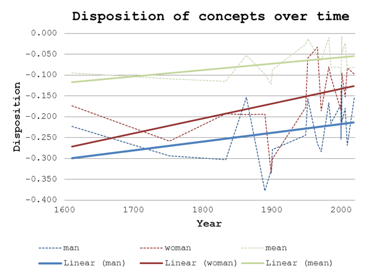

# Bible Sentiment Analysis Readme

This project uses Word2Vec models of individual texts to estimate the shifts in positive and negative sentiments to certain concepts over time. Using a corpus of Bible texts (https://dataverse.orc.gmu.edu/dataset.xhtml?persistentId=doi:10.13021/orc2020/RCCN7C), a Word2Vec model is build for each one, and the proximity of vectors representing different concepts are compared to vectors representing positive and negative sentiment, allowing to approximate the disposition towards these concepts in that particular text. 

Background: Since Bible texts are based on mostly the same source data, the difference in disposition towards words and concepts between different Bibles is mainly the result of personal influence of the translators and creators of these texts. The choice of words and the phrasing in these translations influences how these concepts are percieved by the target audience, and constructing models for each Bible allows us to discern this personal influence when compared against other Bible texts.

**Results:** We can observe a shift in sentiments towards some concepts, as well as a shift towards more positive sentiment in the Bibles as a whole.

**Software versions:**
- Julia 1.7
- Agents.jl 5.1
