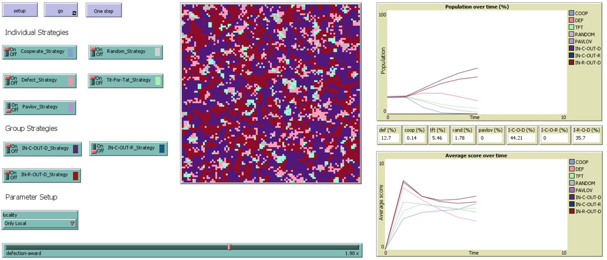

# Evolutionary Competition Framework Model Readme

This model explores the performance of agent strategies in a spatial prisoner's dilemma evolutionary environment. Notably, both individual and group strategies are explored. The group strategies are based on the concept of the in-group/out-group. This model explores strictly local neighborhoods, as well as neighborhoods that include agents from a random location on the map, to simulate one-off interactions that one may encounter.

**Results:** Group strategies drastically outperform individual strategies in almost all neighborhood environment types, with a clique-like in-group cooperate, out-group defect being the most effective.

**Software versions:**
- Julia 1.7
- Agents.jl 5.1

