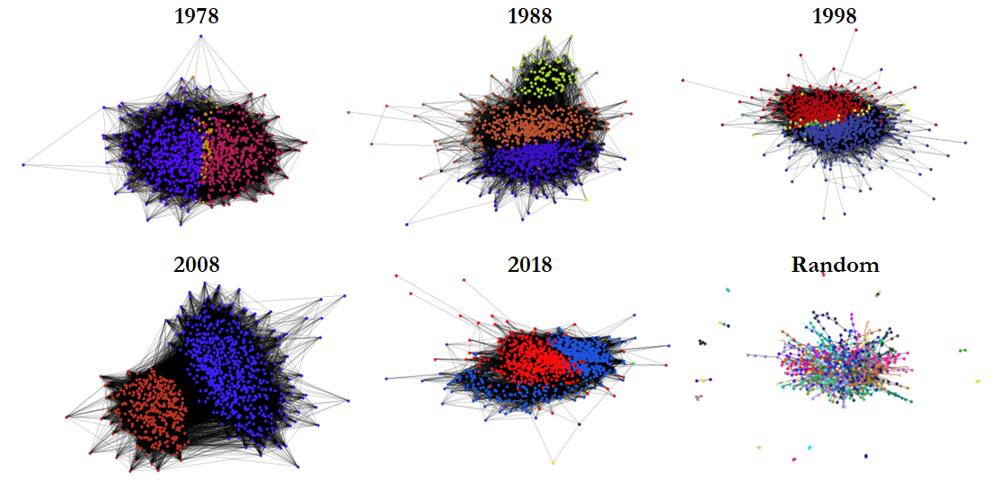

# General Social Survey Polarization Analysis Readme

This project attempts to use the data from the General Social Survey (https://gss.norc.org) and capture the presence and evolution of polarization in the opinions of the individuals based on the recorded data over the years. The central premise is that we can construct a network of people who share similar opinions, which allows us then to utilize various social network analysis tools to obtain additional insights into this data. The network is constructed by taking a GSS data file as an input, which contains thousands of individual responses to 20 questions for a aprticular year regarding various aspects of the government, and treating each responder as an individual node. A link between two nodes is then constructed when those individuals agree in the number of opinions that is a standard deviation above the average number of links that would have been formed by chance. Depending on the year chosen, this results in a cutoff of 10 or 11 similar opinions out of 20, which varies due to the variance in the response options and the questions: since questions have changed over time, similar questions were selected, but an exact match was not always possible.

When such a network is constructed, becomes noticable that a) people that share some opinions tend to share a lot of similar opinions and b) the occurance of shared opinions is significantly greater than would be dictated by chance. This allows us to observe just how similar multiple beliefs are in people that share at least some of the opinions, and how clustered these opinions are to each other, which can be seen as polarization in the population.

To be clear, there are different measures and ideas of what polarization actually means (see https://www.osti.gov/biblio/1106631). In particular, we are interested in Solidarity (as measured by the Global Clustering value), Dispersion (as measured by the Standard Deviation of the Local Clustering values), and Community Fracturing (as measured by the Effective Number of Parties from Laakso and Taagepera, https://doi.org/10.1177/001041407901200101). The visualization of communities is also of interest (see above). All of these different polarization measures are captured in the **gss_polarization.py** file.

**Software versions:**
- Python 3.10
- NetworkX 2.8
