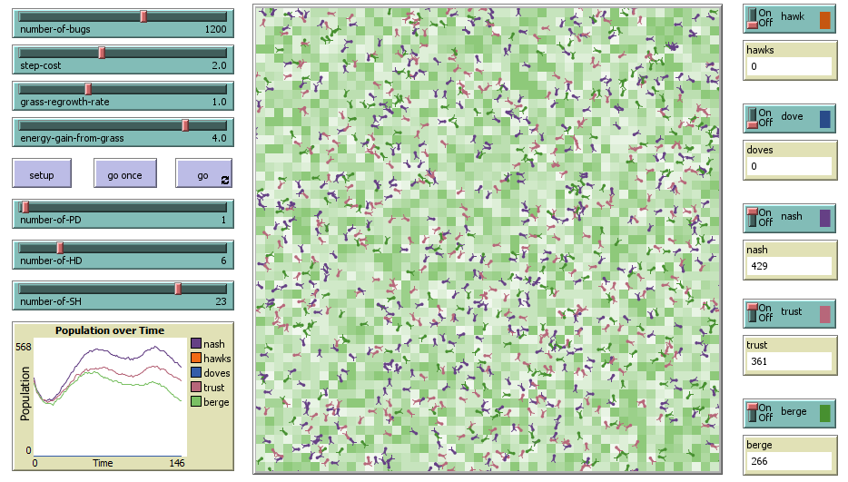

# Rationality Model Readme

This model explores the nature of rational decision making of individuals in complex environments with large populations. When faced with a mix of more realistic game-theoretical scenarions, strategies that include care for others can outperform those focused on selfish gain. 

**Software files:**
- Rationality_Model_Final.nlogo - NetLogo model

**Software versions:**
- NetLogo 6.4.0
