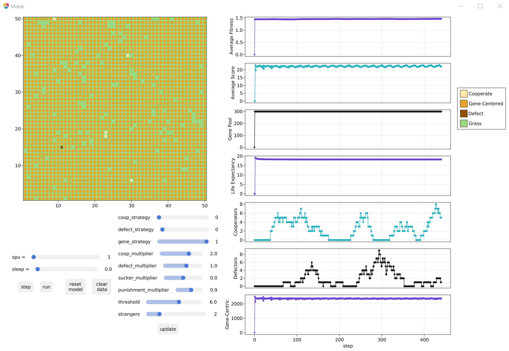

# Serengeti Model Readme

This model explores the gene-centric strategy performance in the population, through an environment that consists of two types of game-theoretical scenarios: Stag Hunt and Hawk-Dove. The reason for their choice is that they have been observed to be more representative of the types of interactions encountered in the wild. 

In addition to the simple exploration of the performance of this strategy, each agent also maintains a simplified DNA representation, allowing to observe how the fitness of the population (e.g. size of the gene pool, life expectancy, and average individual fitness) changes for each strategy type in different environments.

**Results:** this strategy tends to have comparable population fitness to other strategies, and tends to outperform them (or performs as well as them) in a head-to-head competition.

**Discussion:** How exactly does one determine that the individual you are interacting with is related, and to what proportion? The more obvious answer is that time spent . The less obvious answer could be some sort of biological marker that one may perceive without necessarily being aware of it.

**Software versions:**
- Julia 1.7
- Agents.jl 5.1
